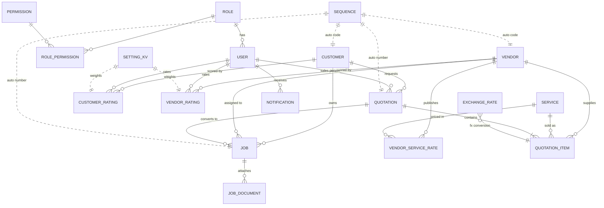

# Database Design — Logistics ERP & CRM

PostgreSQL 16 · Prisma ORM · normalized (3NF) relational design.
Money: `Decimal(14,2)` · rates/factors: `Decimal(14,4..6)` · IDs: UUID.

## Entity Relationship Diagram

## Table Summary

| Table | Purpose | Key relationships |
|---|---|---|
| `users` / `roles` / `permissions` / `role_permissions` | Authentication + configurable RBAC. Six seeded system roles (Administrator, Manager, Sales, Operation, Finance, Viewer); permissions are `module.read` / `module.write` codes attachable to any role. | user → role → permissions |
| `customers` | Customer master. Revenue / profit / last-quotation / score are **calculated** in the service layer from quotations & ratings — never stored stale. | → quotations, jobs, customer_ratings |
| `vendors` | Vendor master with `isPreferred` flag. Overall rating computed from `vendor_ratings`. | → rates, ratings, quotation_items, jobs |
| `services` | Unlimited service catalog (Air/Sea Freight, Custom Clearance, Crane…). | → rates, quotation_items |
| `vendor_service_rates` | The pricing heart: vendor × service × lane (origin/destination/country/state) × rate type (FIXED, PER_KG, PER_CBM, PER_TON, PER_TRIP, PER_CONTAINER, PER_SHIPMENT, PER_HOUR, PER_DAY) with min charge, currency, effective/expiry dates. History preserved — expired rows power historical comparison. | vendor ↔ service (M:N through rates) |
| `quotations` + `quotation_items` | Header/detail. Items snapshot cost & sell at quote time (audit-safe). Totals (cost, sell, GP, GP%, tax, discount, service charge, misc) are denormalized onto the header and recomputed by the costing engine on every item change. | customer, sales person, items → service/vendor/rate |
| `jobs` + `job_documents` | Shipment execution. Created from a WON quotation (one-click conversion) or standalone. Tracks actual cost/revenue/profit vs. quoted. | customer, quotation, vendor |
| `vendor_ratings` / `customer_ratings` | KPI-based scoring (6 criteria each, 1–5). `overallScore` is weighted; weights are configurable in `settings` (`rating.vendor.weights`, `rating.customer.weights`). | vendor/customer, rated-by user |
| `exchange_rates` | Currency pairs with effective dates — used by the costing engine for cross-currency cost items. | |
| `sequences` | Configurable auto-numbering (prefix, padding, per-year reset) for CUST/VEN/SVC/QT/JOB codes. No hardcoded formats. | |
| `settings` | JSON key-value store: rating weights, alert thresholds, quotation defaults, company profile, recommendation weights. | |
| `notifications` | System alerts (quotation expiry, rate expiry, payment due, job delay, high cost, low margin) with `dedupeKey` to prevent duplicates. | user (null = broadcast) |
| `audit_logs` | Who did what to which entity, with JSON detail. | |

## Design Decisions

1. **Snapshot vs. reference** — quotation items store the cost/sell at quote time *and* reference the source `vendor_service_rate`; rate changes never mutate historical quotes.
2. **Calculated fields** — customer total revenue/profit and vendor/customer overall scores are computed on read (with efficient aggregate queries), avoiding stale denormalized data. Quotation totals are the exception: recomputed and persisted by the engine on every write for fast listing.
3. **Future expansion** — invoices and purchase orders can FK to `quotations`/`jobs`; accounting journals to any entity via (`entityType`,`entityId`) as `audit_logs`/`notifications` already do. No redesign needed.
4. **Configurability** — numbering formats, rating weights, alert thresholds, default markup/tax all live in `sequences`/`settings` tables.
